# Lodgini - Platform de Réservation de Propriétés

Lodgini est une plateforme web complète de réservation et gestion de propriétés (appartements, maisons de vacances), construite avec un **stack moderne full-stack** :

- **Frontend** : React 18 + React Router + Material-UI + Bootstrap 5
- **Backend** : Django 5.1 + Django REST Framework + SQLite
- **Client HTTP** : Axios
- **Authentification** : Email-based avec Django

Elle permet aux voyageurs de découvrir et réserver des propriétés, ainsi qu'aux propriétaires de gérer leurs annonces de manière efficace et intuitive.

## 📱 Aperçu de l'Application

### 🏠 Découverte & Navigation
## acceuil
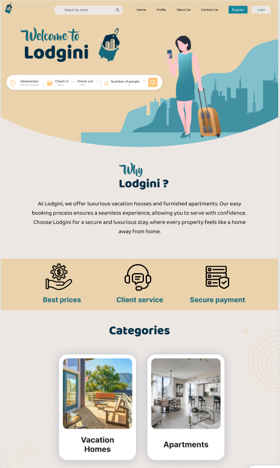
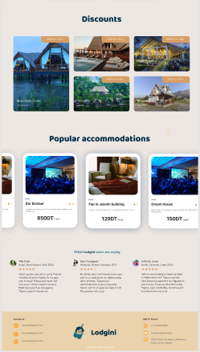


## Liste des logements
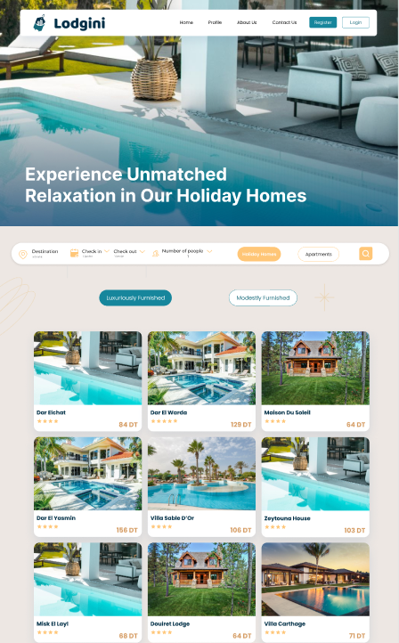
## Détail propriété
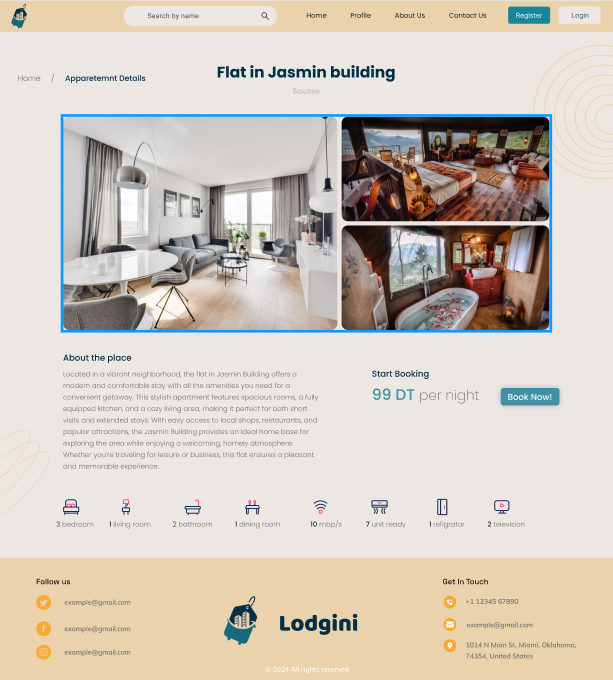

### 🔐 Authentification

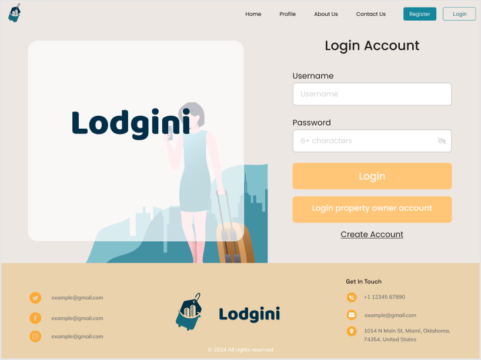

### 🛒 Réservation

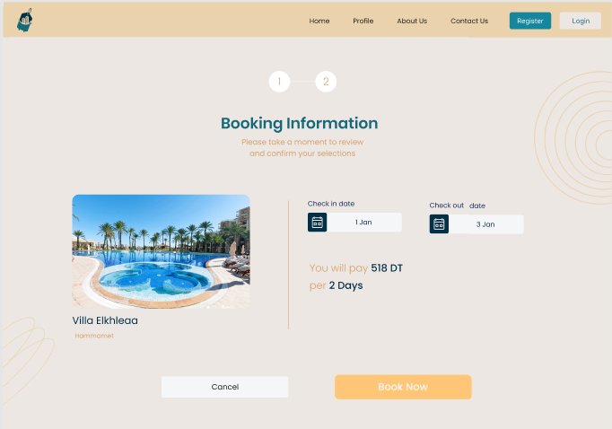
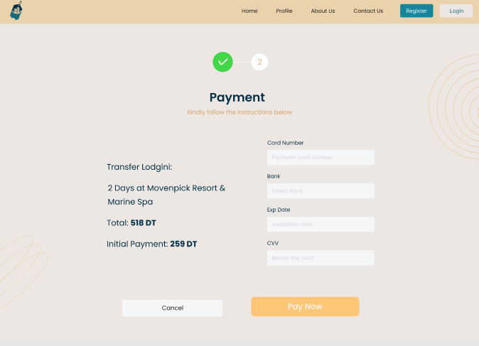
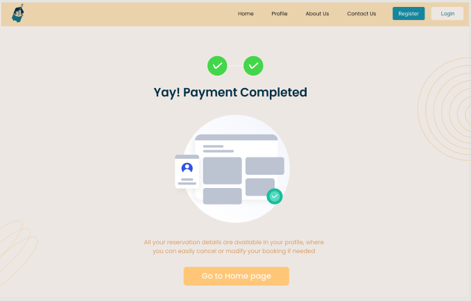

### 👤 Profils Utilisateurs-client

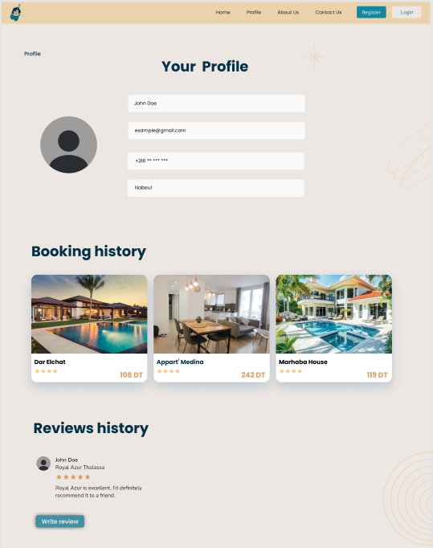
###  Modification d'une reservation
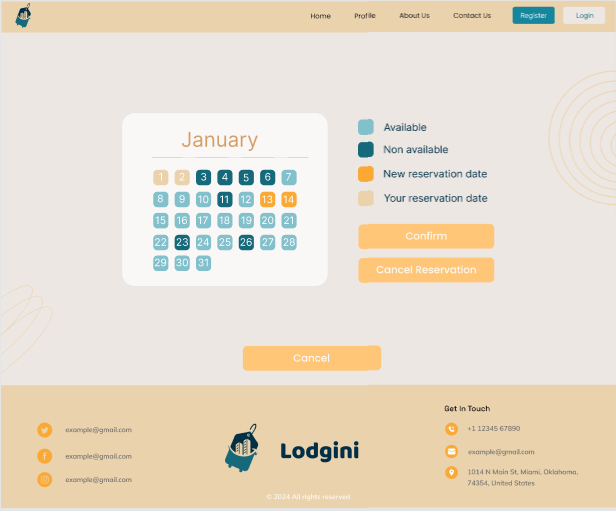

### 👤 Profils Utilisateurs-propriétaire
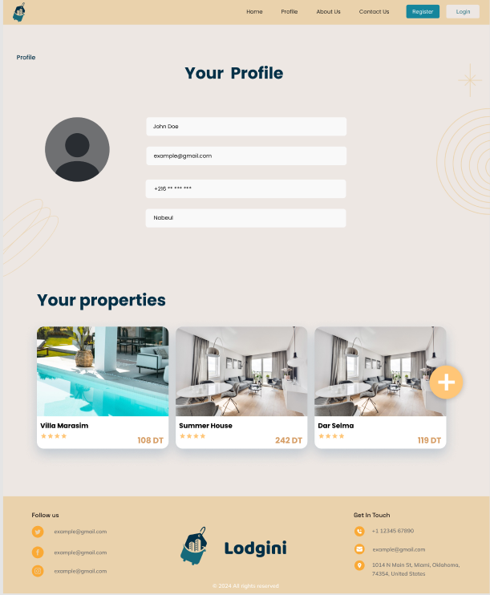


### Ajout d'une nouvelle propriété
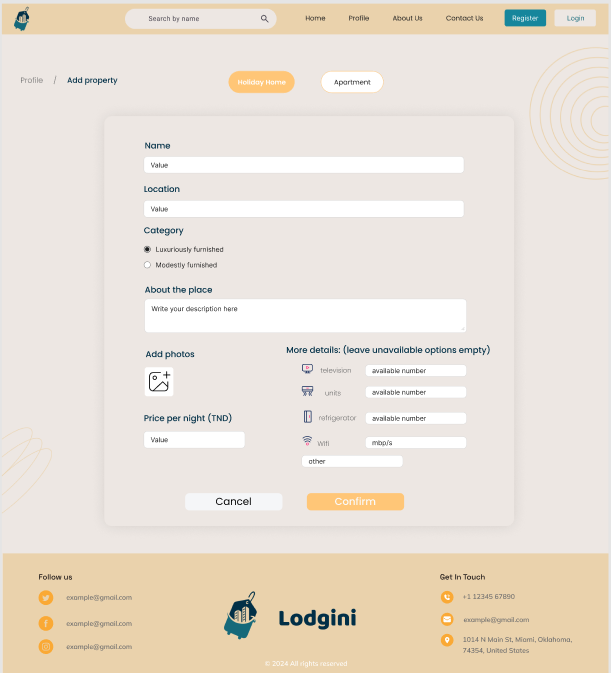
### Modification d'une  propriété
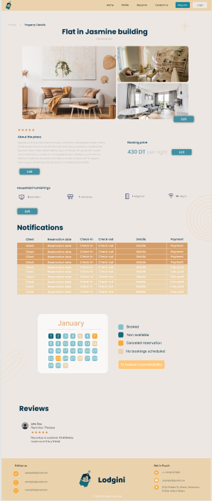

### ℹ️ Pages Secondaires

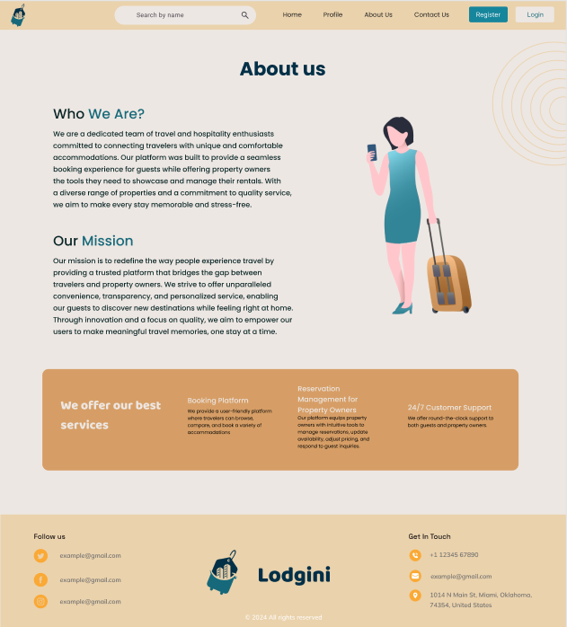

## 📋 Table des matières

- [Caractéristiques](#caractéristiques)
- [Architecture](#architecture)
- [Prérequis](#prérequis)
- [Installation](#installation)
- [Configuration](#configuration)
- [Lancement du projet](#lancement-du-projet)
- [Structure du projet](#structure-du-projet)
- [API Endpoints](#api-endpoints)
- [Technologies utilisées](#technologies-utilisées)

## ✨ Caractéristiques

### Pour les Voyageurs

- 🏠 Parcourir et rechercher des propriétés (appartements, maisons de vacances)
- 📅 Réserver des propriétés avec gestion des dates
- 💳 Processus de paiement intégré
- ⭐ Laisser des avis et des évaluations
- 👤 Profil utilisateur personnalisable
- 🔍 Filtrage par type de propriété et localisation

### Pour les Propriétaires

- 🏢 Créer et gérer des annonces de propriétés
- 📸 Télécharger plusieurs images (jusqu'à 3)
- 📊 Voir les réservations et disponibilités
- ✏️ Modifier les détails des propriétés
- 👥 Consulter les avis clients
- 📱 Profil de propriétaire dédié

### Fonctionnalités Générales

- 🔐 Authentification par email
- 📧 Système d'authentification distinct (voyageurs/propriétaires)
- 🎨 Interface utilisateur intuitive (Bootstrap, Material-UI)
- 📱 Design responsive

## 🏗️ Architecture

Le projet suit une architecture **full-stack** :

```
Frontend (React)          Backend (Django REST API)       Base de données
├── React 18.3            ├── Django 5.1.3               └── SQLite
├── React Router          ├── Django REST Framework
├── Material-UI           ├── PostgreSQL/SQLite
├── Bootstrap 5           └── CORS
└── Styled Components
```

### Stack Technique

**Frontend :**

- React 18.3.1
- React Router v6
- Material-UI (MUI)
- Bootstrap 5
- Axios pour les requêtes HTTP
- Styled Components & Emotion

**Backend :**

- Django 5.1.3
- Django REST Framework
- Django CORS Headers
- SQLite (développement)
- Multer & Axios (gestion fichiers)

## 📦 Prérequis

- **Python 3.8+** (pour le backend Django)
- **Node.js 16+** et **npm** (pour le frontend React)
- **Git**
- Un gestionnaire de packages (pip, npm)

## 🚀 Installation

### 1. Cloner le repository

```bash
git clone <URL_DU_REPOSITORY>
cd lodgini
```

### 2. Configuration du Backend

#### Installation des dépendances Python

```bash
cd backend
python -m venv venv

# Windows
venv\Scripts\activate

# macOS/Linux
source venv/bin/activate

pip install -r requirements.txt
```

#### Configuration de Django

```bash
cd backend
python manage.py makemigrations
python manage.py migrate
python manage.py createsuperuser  # Créer un compte administrateur
```

### 3. Configuration du Frontend

```bash
cd frontend
npm install
```

## ⚙️ Configuration

### Variables d'environnement Backend

Créer un fichier `.env` à la racine du dossier `backend/` :

```env
SECRET_KEY=your-secret-key-here
DEBUG=True
ALLOWED_HOSTS=localhost,127.0.0.1
DATABASE_URL=sqlite:///db.sqlite3
CORS_ALLOWED_ORIGINS=http://localhost:3000
```

### Configuration Django (settings.py)

Les applications Django installées incluent :

- `django.contrib.admin` - Panel d'administration
- `django.contrib.auth` - Authentification
- `rest_framework` - API REST
- `corsheaders` - Support CORS
- `profile` - Gestion des profils utilisateurs/propriétaires
- `management` - Gestion des propriétés et réservations
- `admin_interface` - Interface d'administration personnalisée

## 🎯 Lancement du projet

### Démarrer le Backend

```bash
cd backend
python manage.py runserver
```

Le serveur Django démarre sur `http://localhost:8000`

L'API est accessible sur `http://localhost:8000/api/`

Panel admin : `http://localhost:8000/admin/`

### Démarrer le Frontend

```bash
cd frontend
npm start
```

L'application React démarre sur `http://localhost:3000`

### Exécuter les tests

**Backend :**

```bash
cd backend
python manage.py test
```

**Frontend :**

```bash
cd frontend
npm test
```

## 📁 Structure du projet

```
lodgini/
├── backend/
│   ├── lodgini/                    # Configuration Django principale
│   │   ├── settings.py             # Configuration globale
│   │   ├── urls.py                 # Routage principal
│   │   ├── asgi.py & wsgi.py       # Points d'entrée serveur
│   │   └── __init__.py
│   │
│   ├── profile/                    # Gestion des profils
│   │   ├── models.py               # UserProfile, OwnerProfile
│   │   ├── views.py                # Endpoints d'authentification
│   │   ├── serializers.py          # Sérialisation des profils
│   │   ├── authentication.py       # Authentification par email
│   │   └── urls.py                 # Routes du profil
│   │
│   ├── management/                 # Gestion des propriétés
│   │   ├── models.py               # Property, Booking, Review, PropertyUnavailableDate
│   │   ├── views.py                # Endpoints pour propriétés & réservations
│   │   ├── serializers.py          # Sérialisation des données
│   │   ├── urls.py                 # Routes de gestion
│   │   ├── migrations/             # Historique des modifications BD
│   │   └── admin.py                # Enregistrement admin
│   │
│   ├── admin-interface/            # Interface admin personnalisée
│   │   └── logo/
│   │
│   ├── media/                      # Fichiers uploadés
│   │   ├── properties/             # Images de propriétés
│   │   ├── profile_pics/           # Photos de profil utilisateurs
│   │   └── profile_owner_pics/     # Photos de profil propriétaires
│   │
│   ├── manage.py                   # Utilitaire de gestion Django
│   ├── db.sqlite3                  # Base de données
│   └── api/                        # Endpoints API globaux
│
├── frontend/
│   ├── src/
│   │   ├── componenets/            # Composants React
│   │   │   ├── home/               # Page d'accueil
│   │   │   ├── categories/         # Catégories (appartements, maisons)
│   │   │   ├── sign/               # Pages d'authentification
│   │   │   ├── profile/            # Profils utilisateur/propriétaire
│   │   │   ├── reservation/        # Flux de réservation
│   │   │   ├── Details/            # Détails de propriétés
│   │   │   └── about/              # Page About
│   │   │
│   │   ├── App.js                  # Routage principal React
│   │   ├── App.css                 # Styles globaux
│   │   ├── index.js                # Point d'entrée
│   │   └── setupTests.js           # Configuration tests
│   │
│   ├── public/                     # Ressources statiques
│   │   ├── index.html
│   │   ├── images/
│   │   ├── manifest.json
│   │   └── robots.txt
│   │
│   ├── package.json                # Dépendances npm
│   └── README.md                   # Documentation frontend
│
└── package.json                    # Configuration racine (Axios, CORS, Multer)
```

## 🔌 API Endpoints

### Authentification (Profile)

- `POST /api/profile/login` - Connexion utilisateur/propriétaire
- `POST /api/profile/register` - Inscription utilisateur
- `POST /api/profile/register-owner` - Inscription propriétaire

### Propriétés (Management)

- `GET /api/properties` - Lister toutes les propriétés
- `POST /api/properties/add` - Créer une nouvelle propriété
- `GET /api/properties/{id}` - Détails d'une propriété
- `PUT /api/properties/{id}` - Modifier une propriété
- `DELETE /api/properties/{id}` - Supprimer une propriété

### Réservations (Management)

- `GET /api/bookings` - Lister les réservations
- `POST /api/bookings` - Créer une réservation
- `PUT /api/bookings/{id}` - Modifier une réservation
- `DELETE /api/bookings/{id}` - Annuler une réservation

### Avis (Management)

- `GET /api/reviews` - Lister les avis
- `POST /api/reviews` - Créer un avis
- `GET /api/reviews/{property_id}` - Avis d'une propriété

### Disponibilité

- `GET /api/unavailable-dates/{property_id}` - Dates indisponibles

## 🛠️ Technologies utilisées

### Backend

- **Django** 5.1.3 - Framework web Python
- **Django REST Framework** - Construction d'API REST
- **Django CORS Headers** - Gestion des requêtes cross-origin
- **SQLite** - Base de données (développement)
- **Pillow** - Traitement d'images

### Frontend

- **React** 18.3.1 - Bibliothèque UI
- **React Router** v6 - Routage client
- **Material-UI (MUI)** - Composants UI modernes
- **Bootstrap** 5.3 - Framework CSS
- **Axios** - Client HTTP
- **Styled Components** - CSS-in-JS
- **React Slick** - Carousel d'images

### Tools & Utils

- **Node.js/npm** - Gestion des paquets frontend
- **pip** - Gestion des paquets Python
- **Git** - Contrôle de version

## 📝 Modèles de Données Principaux

### UserProfile

- `email` - Email unique
- `password` - Mot de passe
- `profile_picture` - Photo de profil
- `phone_number` - Numéro de téléphone
- `name` - Nom
- `country` - Pays

### OwnerProfile

- Similaire à UserProfile, pour les propriétaires

### Property

- `name` - Nom de la propriété
- `description` - Description
- `property_type` - Type (Apartment / Vacation House)
- `furnishing_type` - Type d'ameublement
- `location` - Localisation
- `price_per_night` - Prix par nuit
- `image1, image2, image3` - Images
- `number_of_stars` - Évaluation (1-5)
- `owner` - Référence au propriétaire

### Booking

- `property` - Propriété réservée
- `guest` - Voyageur
- `start_date` - Date d'arrivée
- `end_date` - Date de départ
- `total_price` - Prix total

### Review

- `property` - Propriété évaluée
- `guest` - Auteur de l'avis
- `stars` - Note (1-5)
- `content` - Texte de l'avis
